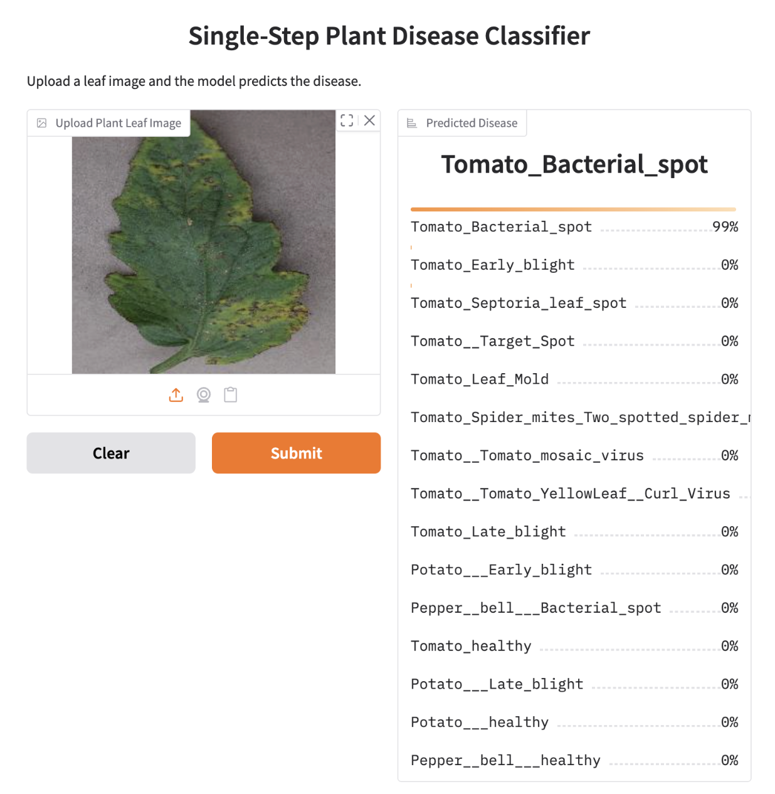

# 🌿 Plant Leaf Disease Detection for Smart Agriculture

> Upload a photo of a tomato, potato, or pepper leaf and get the crop and its disease in under a second, using deep learning.


<!-- Replace assets/demo.png with a screenshot of your Gradio app (e.g. the Tomato Bacterial Spot prediction from Fig. 2 of your report). -->

## About

Plant diseases cause major crop losses, and manual inspection is slow and needs an expert. This project classifies leaf images into **15 crop-disease classes** (Tomato, Potato, Pepper) using transfer learning with **MobileNetV3Large**, and serves predictions through a simple **Gradio** web app that shows a confidence score for every class.

Three approaches were built and compared:

| Model | Accuracy | Precision | Recall | F1-Score |
|---|---|---|---|---|
| **Single-step** (crop + disease in one pass) | **98.4%** | 98% | 99% | 98% |
| Hierarchical (crop first, then crop-specific disease model) | 98% | 97% | 97% | 97% |
| Custom CNN (built from scratch, baseline) | 88% | 85% | 89% | 85% |

Transfer learning improved accuracy by about 10 percentage points over the CNN trained from scratch.

## Key Features

- **One-step prediction:** identifies both the crop and the disease in a single forward pass
- **Hierarchical alternative:** a crop classifier routes each image to a crop-specific disease model
- **Automated tuning:** hyperparameters (learning rate, optimizer, batch size, dropout) optimized with **Optuna**
- **Class imbalance handling:** data augmentation (rotation, shifts, shear, zoom, flips) for under-represented classes
- **Lightweight model:** MobileNetV3Large keeps inference fast and suitable for edge deployment
- **Interactive web demo:** upload an image and see per-class confidence scores
- **Full evaluation:** accuracy, precision, recall, F1-score, and confusion matrices for every model

## Dataset

[PlantVillage](https://www.kaggle.com/datasets/emmarex/plantdisease) (Tomato, Potato, and Pepper subset): **20,638 images**, 15 classes, split 70% train / 20% validation / 10% test.

## Quick Start (about 5 minutes)

### Prerequisites
- Python 3.10 or newer
- `git` and `pip`

### 1. Clone the repository
```bash
git clone https://github.com/yasminemagdy/plant-disease-detection.git
cd plant-disease-detection
```

### 2. Create a virtual environment (recommended)
```bash
python -m venv venv

# macOS / Linux
source venv/bin/activate

# Windows
venv\Scripts\activate
```

### 3. Install dependencies
```bash
pip install -r requirements.txt
```

### 4. Get the trained model
Download the trained weights from **[this link](models/single_step_model.keras)** and place the file in the `models/` folder:

```
models/
└── single_step_model.keras
```

### 5. Run the app
```bash
python app.py
```

Open the local URL printed in the terminal (usually `http://127.0.0.1:7860`), upload a leaf image, and click **Submit**.

## Usage

1. Upload a clear photo of a single tomato, potato, or pepper leaf.
2. Click **Submit**.
3. The app shows the predicted class (for example, `Tomato_Bacterial_spot`) with confidence scores for all 15 classes.

**Retraining from scratch:** download the dataset from Kaggle, place it in `data/`, then open the training notebook in `notebooks/` (designed for Google Colab with a T4 GPU).

## Project Structure

```
plant-disease-detection/
├── app.py              # Gradio web app
├── requirements.txt    # Python dependencies
├── models/             # Trained model files
├── notebooks/          # Training and evaluation notebooks
├── assets/             # Screenshots for this README
└── README.md
```

## Tech Stack

- **Language:** Python
- **Deep learning:** TensorFlow, Keras (MobileNetV3Large, transfer learning)
- **Hyperparameter tuning:** Optuna (TPE sampler with pruning)
- **Web interface:** Gradio
- **Training environment:** Google Colab (T4 GPU)
- **Evaluation:** scikit-learn metrics, confusion matrices

## Limitations

- PlantVillage images are taken under controlled conditions (plain backgrounds, consistent lighting). Performance on real field photos is untested and is likely lower.
- The dataset is imbalanced (for example, only 152 healthy potato images), so results on small classes should be read with care.
- Only three crops and 15 classes are supported.

## Future Work

- Test on real-world field images and add cross-domain evaluation
- Try transformer-based architectures and model ensembling
- Export to TensorFlow Lite or ONNX for deployment on edge devices such as Jetson

## Author

- **Yasmin Magdy Loksha** ([LinkedIn](https://linkedin.com/in/yasmine-magdy-loksha))


Department of Electrical, Computer and Biomedical Engineering, Abu Dhabi University.

## License

Released under the [MIT License](LICENSE).
